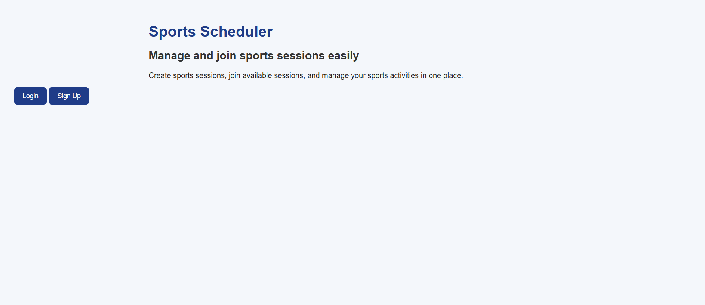
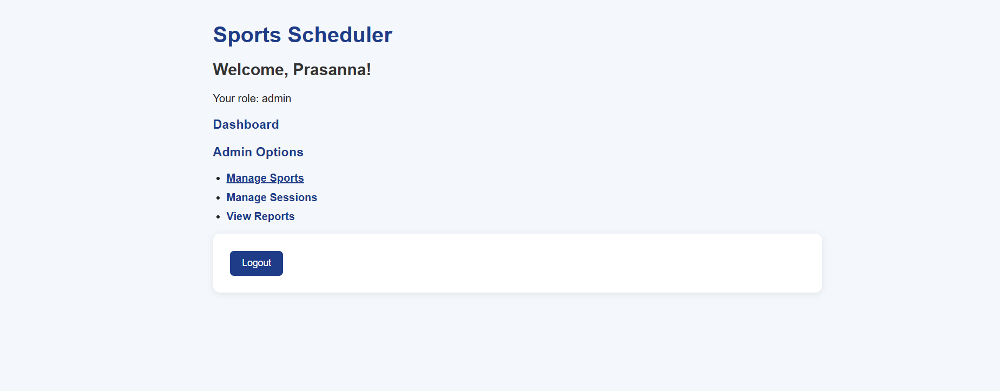
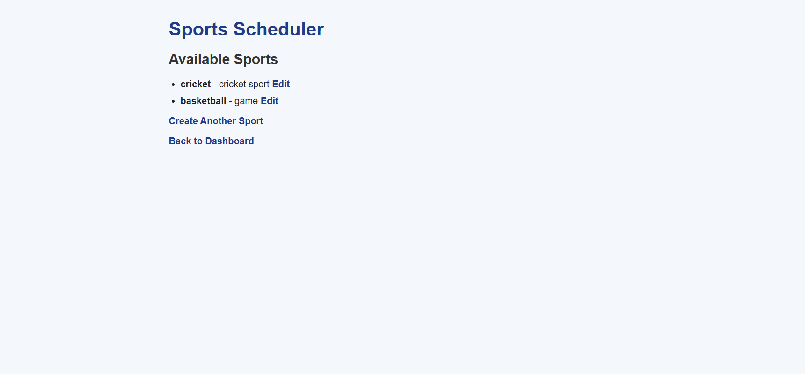
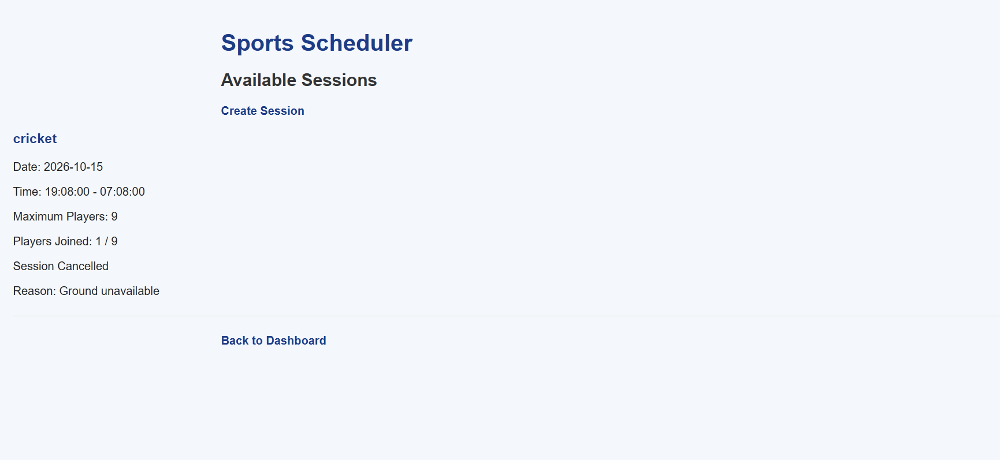
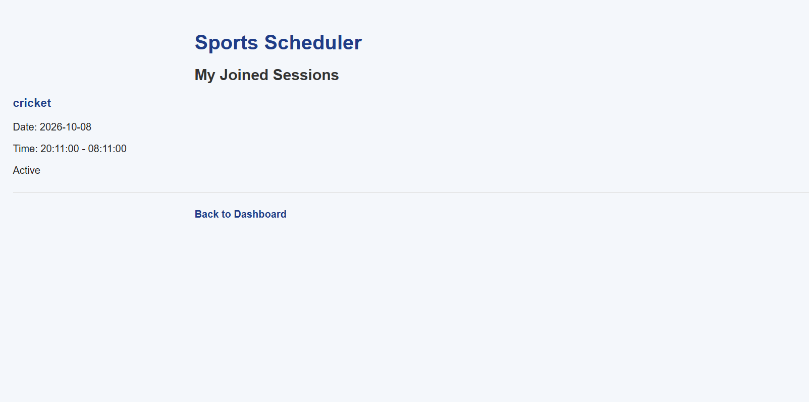
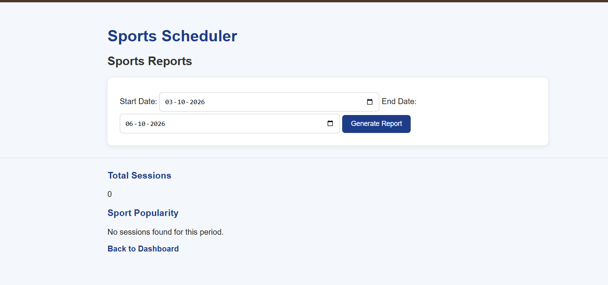

# Sports Scheduler

Sports Scheduler is a web application that allows users to create, browse, join, and manage sports sessions.

The application supports two types of users:

- **Admin**
- **Player**

The system uses role-based access so that admins and players have different capabilities.

## Features

### Authentication
- User signup
- User login
- User logout
- Session-based authentication
- Password hashing using bcrypt
- Role-based access for Admin and Player

### Admin Features
- Create sports
- Edit sports
- Create sports sessions
- Edit sessions
- Cancel sessions with a cancellation reason
- View session reports
- Filter reports by date
- View sport popularity
- View total sessions

### Player Features
- Browse available sports
- Browse sports sessions
- Create sessions
- Join available sessions
- View joined sessions
- See session cancellation information

### Session Management
- Maximum player limit
- Player count for each session
- Prevent joining a full session
- Prevent duplicate joining
- Cancel sessions with a reason
- Cancelled sessions are excluded from reports

## Technology Stack

### Frontend
- HTML
- CSS
- EJS

### Backend
- Node.js
- Express.js
- Passport.js
- Passport Local Strategy

### Database
- PostgreSQL
- Sequelize ORM

### Other Technologies
- bcrypt
- express-session
- dotenv
- Render

## Project Structure

```text
sports-scheduler/
│
├── config/
├── middleware/
├── models/
├── routes/
├── views/
├── public/
│   └── style.css
│
├── app.js
├── index.js
├── package.json
├── .gitignore
└── README.md

## Screenshots

### Home Page


### Admin Dashboard


### Sports Management


### Sessions


### My Joined Sessions


### Reports
